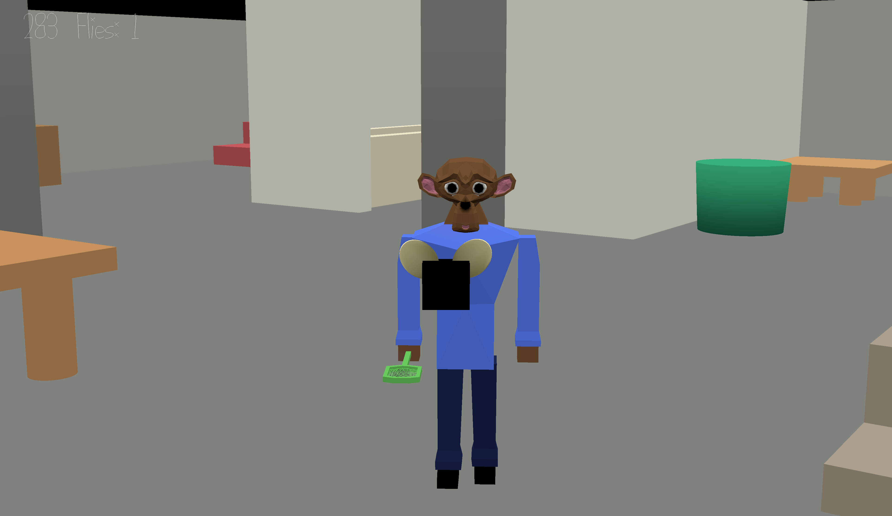

Flieger War

Authors: Ryan Lee, Bernardo Miranda, Robert May

Design: The game is a about a battle between flies and humans. The humans are
trying to kill all the flies while the flies are trying to run away and survive.
Flieger War's unique take on a survival game brings new life and comedy to the
genre.

Networking: Our game implements a server authoritative system. Clients only send
their inputs and then the server simulates all the movement, collisions, and win
condition then broadcasts the current game state to every Client. We implemented
this by improving the base code to handle larger messages and controls, and also
added a role to each Player state to differentiate the flies from the humans.
Each role is treated differently in update and other functions to allow for one
Player state struct for two different types of players. The two messages
transmitted are the C2S_Controls messages which hold the state of each button
and the S2C_State messages which hold the game-wide state. The main part the
code is in Game.cpp, Game.hpp, server.cpp, client.cpp, and PlayMode.cpp.

Screen Shot:

How To Play:

You can choose to play as a human or a fly. As a human, your goal is to kill all
the flies buzzing around. As a fly, your goal is to survive 5 min without dying.

Human Controls: W - Move Forward A - Move Left S - Move Back D - Move Right
Space - Swat

Fly Controls: W - Move Forward A - Move Left S - Move Back D - Move Right
Space - Fly Up Shift - Fly Down

Note: Blender seems to have some inconsistent behavior when exporting from
different scenes. Only the scene I have open when I save the file gets correctly
exported, the others get corrupted. Running the export scripts without this in
mind can corrupt the data and cause the game to fail. The exports we currently
have saved should work.

Sources: Menu theme composed by Johnny May (he liked our main theme so he made a
cover which we used for the menu), used with permission

This game was built with [NEST](NEST.md).
